Falta explicación de las middleware, pedidos.Routes, server.js donde incluimos la ruta pedidos y las rutas de gestión de errores 

# 32.- Front de pedidos

     Ya terminamos el backend de pedidos, ahora toca crear el front. 

     --> Creamos el carrito
        --> Creamos una sección para el carrito donde lo iniciamos como "Tu carrito está vacío", algo que cambiaremos desde el script 

        Iniciamos el Total en 0 y creamos los botones crear pedido y vaciar carrito. 

    --> Creamos la sección Pedidos
        --> Aquí usaremos las funciones creadas en el modelo para mostrar el listado de productos.

        --> Ponemos un botón actualizar. 
        -->

# 33.- Script del front.

Añadimos estados nuevos. Antes teniamos usuario y token, ahora añadimos productos:[] y carrito:[]
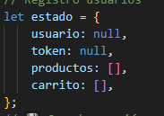

* --> getAuthHeaders()
    --> La variable headers, aqui guardamos la cabecera con el formato que nos da express. 

    --> En el condicional verificamos el token. Preguntamos si en el estado hay un token y dentro llamamos a la cabecera del la middleware y con el método "Authorization" pedimos que nos compruebe si es correcto --> Verificar si es así

    --> Pedimos que nos devuelva headers 
    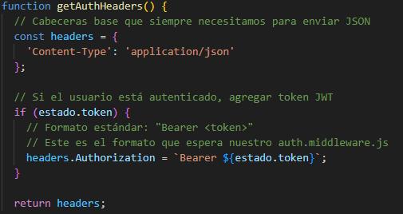

--> Función estaLogueado ()
    --> Aquí usamos la doble negación para transformar la comprobación que le pedimos en un booleano y luego pasa de FALSE, como nace, a TRUE. Es decir:
    Pedimos está dentro del estado "usuario" y "token" y si es así que nos devuelva TRUE. 
    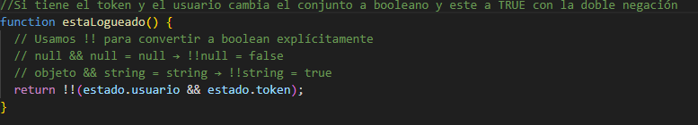


//Esto no vale!!! desde aquí hasta el siguiente comentario
-->Función agregarAlCarrito 
    --> 1º Comprobamos si el cliente está loggeado:
        En este caso la comprobación la realizamos con la negación, es decir, si el usuario no está logado, según nos indique la función estaLogueado(), devolverá una ventana de alerta y cortará la función y no seguirá ejecutandose. 
        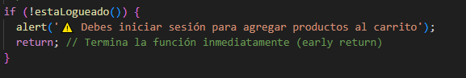

   * --> 2º Verificamos los datos: 
        Creamos una variable producto en el que usaremos estado y accedemos a productos que es un componente el cual es un array y usamos el método find. Dentro de los parentesis realizamos la función flecha donde buscamos  la id de productoId y si lo encuentra devulve el objeto y si no devuelve undefined
        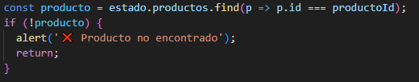

        Cómo se llena el array productos ? 

      *  Desde la función cargarProductos realizamos la petición para que nos muestre el listado de productos guardados en la BBDD, entonces obtenemos todos los datos de la tabla productos que guardamos en la variable datos y los datos vienen cargados en data. Pero claro, como se llena el array productos? Pues igualamos datos a estado.productos, es decir, le decimos que estado.productos es igual a los datos que obtenemos de la base de datos. 
        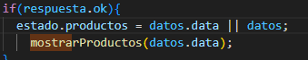

    --> 3º Verificamos el stock:
        --> Realizamos esto con un condicional donde preguntamos si producto.stock es menor que cantidad, si se cumple esta condición, la función se para y avisa al cliente que no hay suficiente stock. 
        De donde viene cantidad? Es un botón que tenemos en el front que suma unidades de un producto. 
        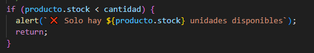
    
    --> 4º Verificamos duplicados: 
        --> Realizamos una busqueda en el array carrito del estado con el método find y comprobamos si productoId existe ya en el array. 
        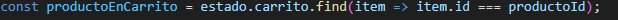
        
        --> Comprobamos si el producto está ya en carrito: 
         Comprobamos productoEnCarrito con un condicional. Aquí decimos que hacemos si una id de producto está duplicada y como calcular cantidades. 
         Creamos una variable nuevaCantidad y sumamos la cantidad de productoEnCarrito más cantidad. 

         Luego comprobamos si nuevaCantidad es mayor que producto.stock para que no nos deje agregar más producto del que tenemos en stock. 

         Si no es así podemos decir que productoEnCarrito.cantidad es igual a nuevaCantidad

        --> En el else, comprobamos si hay un producto nuevo en el carrito

        Si se cumple esta condición le decimos que en el array carrito realice un push (agregar) los datos del nuevo producto con todos los datos obtenidos del back (id,nombre,precio, cantidad, stock)


--> Función quitarDelCarrito 
    --> Necesitamos el parámetro productoId para realizar esta función
    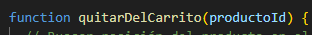

    --> Creamos la variable index donde realizaremos una busqueda en el array de carrito usando el método "findIndex" donde comprobaremos que item tenga la id igual al producto id. 

    Esto lo usaremos en el condicional para realizar el borrado. 

   * --> Decimos que si index es distinto de -1 
        --> Creamos una variable producto donde guardaremos la busqueda index en el array de carrito
        

        --> Entonces usamos el método "splice" de los arrays para borrar el id del producto encontrado en index y le indicamos que sea solo 1 la cantidad a borrar. 

        --> Por último, llamamos a las funciones mostrarCarrito y actualizarBotonCarrito.

--> Función cambiarCantidad ()
    --> Usamos 2 parámetros "productoId" y "nuevaCantidad"
    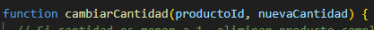
    --> Si nuevaCantidad es menor a 1 eliminamos el producto completamente, para esto llamamos a la función quitarDelCarrito y le indicamos en parámetro "productoId" para que sepa cual borrar
    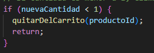

   * --> Buscamos el producto en el carrito usando el método "find" de los arrays
    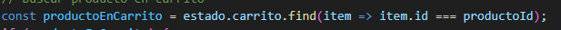

    --> Luego usamos esta busqueda en la condición del condicional para sumar la cantidad, pero antes comprobamos que el stock no exceda el stock disponible con otro condicional donde comparamos nuevaCantidad sea mayor que productoEnCarrito.stock y si se cumple mandamos aviso y la función deja de ejecutarse. 
    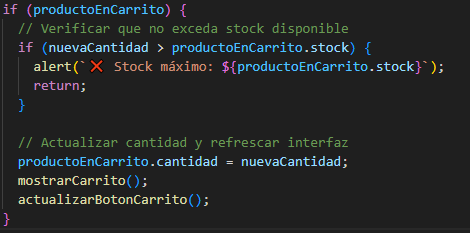

    Una vez hecha la comprobación, actualizamos la cantidad donde le decimos que productoEnCarrito.cantidad es igual a nuevaCantidad. 

    Terminamos llamando mostrarCarrito() y actualizarBotonCarrito ()

--> Función calcularTotal () 
    --> 
    //Hasta aquí 

# 34.- Carrito
 *
    --> Función cargarProductosTienda()
        --> Aquí nos traemos la función obtenerProductos() y la metemos en una variable para usarla como parámetro. "Lista" es nuestra variable que recoge un array llenandose con "datos" que son los datos que trae la función "obtenerProductos()".
        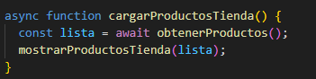
        --> Llamamos a la función mostrarProductosTienda() y la indicamos el parámetro "lista".  
        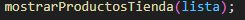
    *
    --> Función mostrarProductosTienda(lista)
        --> Creamos la relación desde script con el DOM a traves de document.getElementById con la variable "contenedor". 
        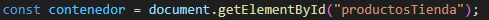

        Qué queremos hacer con esto? 
*
        Queremos que nos cree un div con todos los datos de lista y para esto usamos un condicional en el que preguntamos si "contenedor" no existe haz lo siguiente: 
        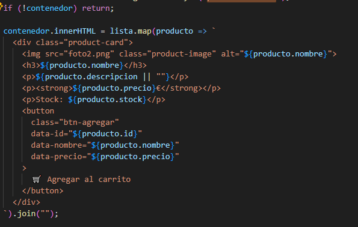

        --> Creamos un evento para los botones, pero, por qué?
        Como los botones se van a crear de forma automática para cada uno de los productos necesitamos que cada botón sepa a que producto corresponde a cada uno.
*
        Cómo sabe esto? 
        1º --> En el condicional anterior le indicamos los datos que va a recoger: 
        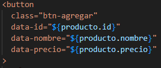
        Como vemos, dentro de la etiqueta botón introducimos "data" donde indicamos con qué lo vamos a rellenar. 

        Y como se llena el botón? 

      Pues creamos un forEach para recorrer el array que le traemos y dentro     creamos el evento a escuchar "click" donde le indicamos que "producto" es un objeto que contiene los siguientes datos: 
            --> id: Number(btn.dataset.id) --> esto quiere decir, que id es un número "Number" y que llene "dataset" con id. 
            Con "Number" parseamos o cambiamos el dato, que viene como string a number o int "1" a 1
            --> nombre: btn.dataset.nombre
            --> precio: Number(btn.dataset.precio)
 **           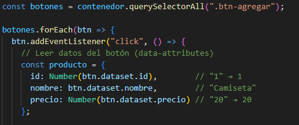
       
       --> Por último, llamamos a la función agregarAlCarrito(producto) que contiene el parámetro "producto" que es la variable que hemos declarado dentro del forEach y con esto llenamos de datos la función agregarAlCarrito().
 **       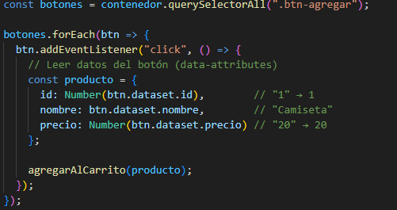

 IMPORTANTE, EN CERRAR SESIÓN INDICAMOS QUE BORRE CARRITO DE LOCALSTORAGE PARA QUE NO SE QUEDE COLGADO  
 ```js
 estado.carrito = { items: [], total: 0 };
 localStorage.removeItem("carrito");
 ```

*    --> Función cargarCarrito()

        Esta función es para que recupere el carrito si el usuario salió sin cerrar sesión. 

        
        --> Creamos la variable "guardado" que recogerá los datos de localStorage que con el método ."getItem" y que lo guarde en el campo "carrito". 
        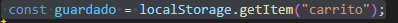

        --> Ahora que tenemos "guardado" lo usamos para generar un condicional con el que si le decimos que si existe un carrito